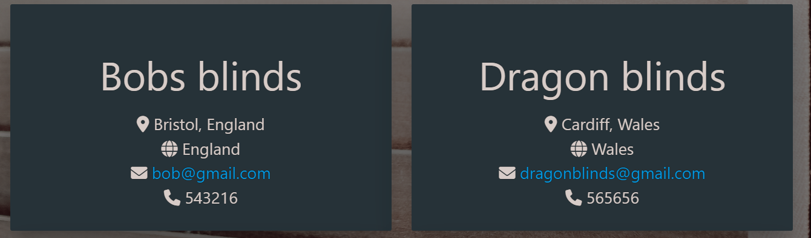
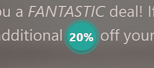
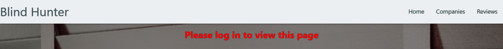
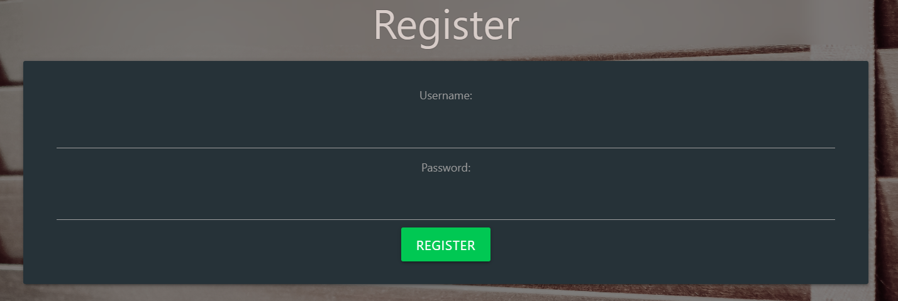
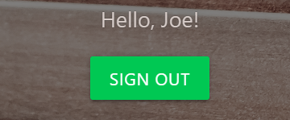
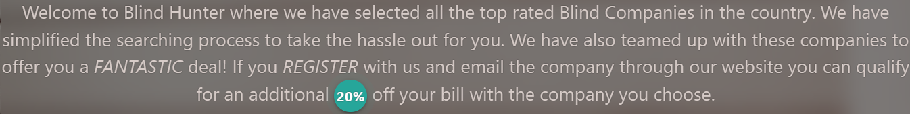
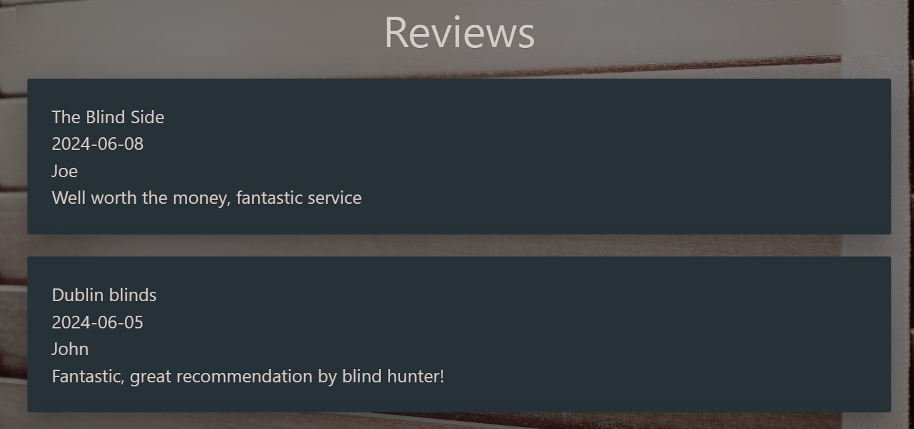
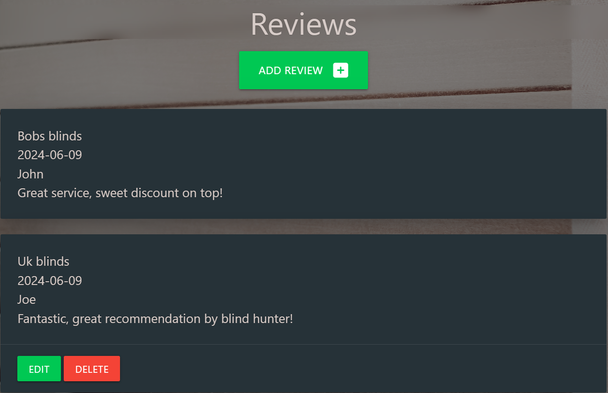
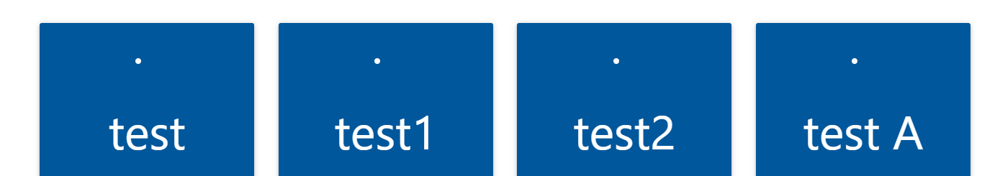
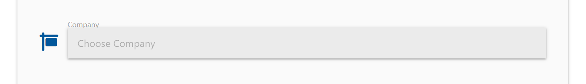

# Blind Hunter

## Developer goals

- I would like to build a website which will save the user effort on searching.
- I would like users to be able to benefit from using the website.
- I would like to build a website which is easy to use.
- I would like to make the user able to have their own profile for when they use the website.

## User goals

- I want to easily search and find what I am looking for.
- This website should be easy to navigate without being confusing.
- I would like the users to easily identify why they would benefit from using the site.
- Users should feel they want to use the site as often as possible to benefit them.

## User stories

As a user of this quiz, I want:

- To be able to easily navigate through the website.
- To be able to benefit from using this website.
- To know what the next steps are to contact companies.
- To be able to create a new profile.
- To be able to log back in as myself to leave new reviews and get discounts.

---

## Design choices

- The basic colour range for this quiz are with the following colours :-
-  `#ffffff`
-  `#455a64`
-  `#00c853`
-  `#000000de`
-  `#f44336`
-  `#26a69a`

- I chose these colours as they are fashionable colours for blinds.
- I chose green and red for button navigation as they are universally recognised.
- I felt these colours blended well to make an appealling website.

---

## Wireframes

Here are the original wireframes:
I have made the three main pages of the site.
- Home page consists of an explanation of the site with navigation and log in\register buttons. Once logged in this will change to one log out button.
- The companies page will consist of square cards showing the different companies with their details and contact info.
- The reviews page will show rectangular cards with user, company they are reviewing and their review.
- [Wireframes](https://github.com/Seanl80/MS3/blob/main/blindhunter/static/wireframes/blind-project-wire-frames.pdf)

---

## Technologies used

- For this website I have chosen to use HTML, CSS and JavaScript.
- I have also used Python and Postgresql.
- I have also included Materialize.
- Gitpod was used as my IDE.
- GitHub was used to store my code.
- Heroku was used to deploy the website.

---

## Testing

I have used these validators to check the validity of my code.

- [W3C CSS Validation](https://jigsaw.w3.org/css-validator/)

- [W3C Markup Validation](https://validator.w3.org/)

- [JShint JavaScript Validation](https://jshint.com/)

## Testing Developer Goals

- I would like to build a website which will save the user effort on searching. 

   In this website I have included blind companies and their details as well as area covered to save users time on searching for blind companies in their area. 
   
- I would like users to be able to benefit from using the website. 

   I have clearly stated on the front page of this website that users will get 20% off if they email companies through our link. To view companies you must register first. If the companies tab in the nav bar is clicked a flash message will prompt you to sign in or register first.  
     
     
- I would like to build a website which is easy to use. 

   The easy to see buttons and navigation bar helps users to navigate. Users can view reviews without logging in or registering, but in order to view companies you have to. Flash messages prompt the user into the next step needed to take in order to navigate.   
     
     
- I would like to make the user able to have their own profile for when they use the website.

   I found the best way of doing this was to show the user the benefits of using this webite on the main page and by allowing them to see user reviews before making a decision about doing so. Also by doing this the user will qualify for the discount and be able to leave a review at the end of the process.  
     
     

## Testing User Stories

As a user of this quiz, I want:

- To be able to easily navigate through the website.  
    By using flash messages and having visible buttons users have found the layout structure easy to navigate through.  
    By understanding what this website is about.  
       
    Reading other users reviews.
       
    Registering or logging in to view and contact companies.  
      
      
    Then leaving a review about the service.
    
- To be able to benefit from using this website.
    Users are aware they can recieve discount from the home page text with with amount of savings highlighted through a pulse function in Materialize.  
    
- To know what the next steps are to contact companies.
    Again in the home page text it describes the steps of contacting the companies and how to claim discount in doing so.
    
- To be able to create a new profile.
    Users are able to create a profile simply by registering under a name of their choice.
    
- To be able to log back in as myself to leave new reviews and get discounts.
    Users are able to log back in using the log in button and they will have access to their old reviews but still able to claim discount by contacting the companies through the website.  
    

---

## Bugs

I did encounter a few bugs. The first was when I made up the company cards I had a dot showing above the company info. This was a list marker which I had to take out using css.

When I was making the reviews page I added in a select list to contain all the companies in the companies page. When selecting it I couldn't access them. This was fixed by targeting it more specifically in the code.

I also found that although I had planned to use datepicker through Materialize I wanted the date of the review recorded as I found when other than that days date was selected sometimes it would create an error. I tried to get that through datepicker but it seemed like an excessive amount of code just to use it so I disregarded datepicker and used javascript to create clean code.

I also realised I could duplicate company details without error. I know some blind companies do share the same or similar names. So I removed the unique=True from the name and inserted it into the email and phone within the company db. This would throw errors show I put in a try/except rule into my add_company and edit_company routes to catch this error. I didn.t have to do this in my reviews as usernames should be unique and it wouldn't matter if the reviews were the same as long as they were under different usernames.

## Deployment

This project was developed using the [Gitpod IDE](https://https://gitpod.io/). Then developments and changes were commited and pushed to GitHub.

To clone this project into Gitpod you will need:

1. A GitHub account. [Create a GitHub account here](https://www.github.com).
2. Use the Chrome browser.

Then follow these steps:

1. Install the Gitpod Browser Extensons for Chrome.
2. After installation restart the browser.
3. Log into Gitpod with your Gitpod account.
4. Navigate to the Project GitHub repository.
5. Click the green "Gitpod" button in the top right of the repository.
6. This will trigger a new gitpod workspace to be created from the code in github where you can work locally.

To deploy this page from Heroku, the following steps were taken:

1. Type pip3 freeze --local > requirements.txt into the Gitpod terminal to create a requirements.txt file.
2. Type echo web: python app.py > Procfile into the terminal to create a Procfile.
3. Commit and push the changes to GitHub.
4. Create a Heroku Account and log in.
5. Click 'New' -> 'Create new app'.
6. Enter a name for your project and select your region.
7. Click 'Create app'.
8. Go to 'Settings', click 'Reveal Config Vars'.
9. Add the following variables:
- DATABASE_URL: your database url can go here
- IP: 0.0.0.0
- PORT: 5000
- SECRET_KEY: your secret key
- DEBUG: False
10. Click on the 'Deploy' tab.
11. Click 'Connect to GitHub'.
12. Find your repo and click 'Connect'
13. Click 'Deploy Branch'.
14. Click 'More' -> 'Run console'
15. Type in python3
16. Type from blindhunter import db -> db.create_all() -> exit().
17. Click 'Open App'.

---

## Credits

### Code

My thanks go out to tutors Sarah and John at Code institue for their assistance in problems.

### Media

- For my image I used [Freepik](https://www.freepik.com/).
- For my favicon image I used [Icon Archive](https://www.iconarchive.com/show/sleek-xp-basic-icons-by-hopstarter/Money-icon.html).
- To show my website on different screens I used [Am I responsive](https://ui.dev/amiresponsive/) to create them.
- For my wireframes I used [Balsamiq](https://balsamiq.com/).

