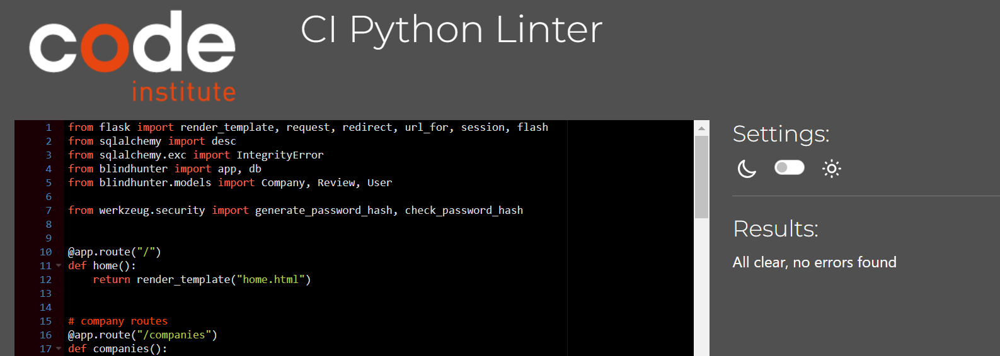
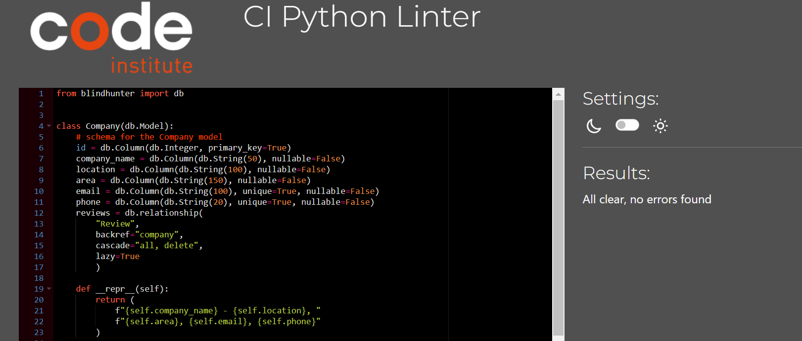
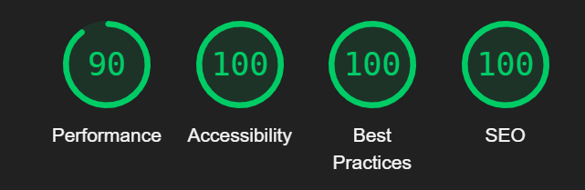
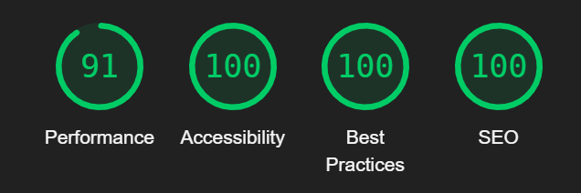
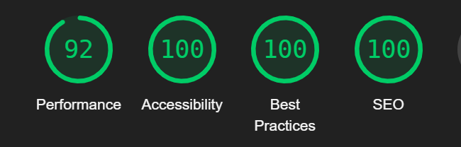

# Blindhunter

This is the results of the testing of Blindhunter and where it was tested.

## Testing

I have used these validators to check the validity of my code with the results included.

- [W3C CSS Validation](https://jigsaw.w3.org/css-validator/)  

    

- [W3C Markup Validation](https://validator.w3.org/)  

      
      
      
      
      
      
      
      
      
      
      
    
- [JShint JavaScript Validation](https://jshint.com/)

    

- [CI Python Linter Validation](https://pep8ci.herokuapp.com/) 

    With my routes.py and my modals.py I found the only issues I had were :
        whitespace, not enough lines of space between code and lines of code being too long all of which I have fixed.

      
    

## Lighthouse performance results

Home page  
  

Companies page  
  

Review page  
  
