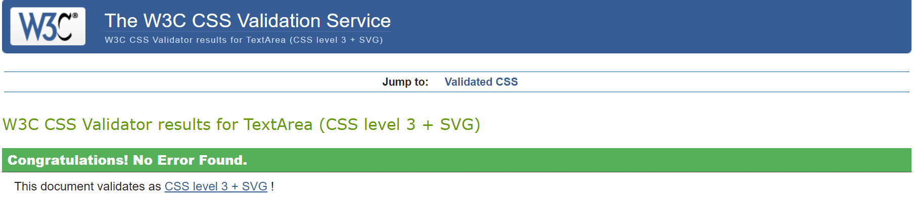

# Blindhunter

This is the results of the testing of Blindhunter and where it was tested.

## Testing

I have used these validators to check the validity of my code with the results included.

- [W3C CSS Validation](https://jigsaw.w3.org/css-validator/)  

    

- [W3C Markup Validation](https://validator.w3.org/)  

      
      
      
      
      
      
      
      
      
      
      

- [JShint JavaScript Validation](https://jshint.com/)

    

- [CI Python Linter Validation](https://pep8ci.herokuapp.com/) 

      
    